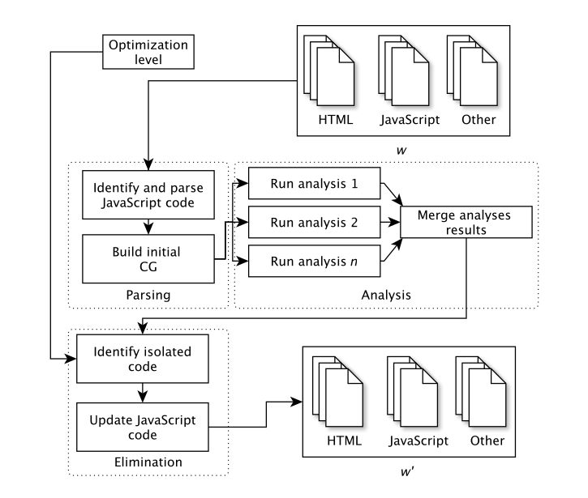

# Lacuna 
An approach for JavaScript dead code elimination, where existing JavaScript analysis techniques are applied in combination.

<p align="center">

</p>

## Publications about Lacuna

A in-depth description of the Lacuna approach, its implementation, its internal and external evaluation, and an empirical study on the overhead of JavaScript dead code on the energy and performance of mobile Web apps, please refer to the following publication:
- Ivano Malavolta, Kishan Nirghin, Gian Luca Scoccia, Simone Romano, Salvatore Lombardi (2023). JavaScript Dead Code Identification, Elimination, and Empirical Assessment. IEEE Transactions on Software Engineering (TSE) - [PDF](http://www.ivanomalavolta.com/files/papers/TSE_2023.pdf)

The main principles, structure, and empirical evaluation of a first version of Lacuna are available in the following scientific publication:
- Niels Groot Obbink, Ivano Malavolta, Gian Luca Scoccia, Patricia Lago (2018). An Extensible Approach for Taming the Challenges of JavaScript Dead Code Elimination. In Software Analysis, Evolution and Reengineering (SANER), 2018 IEEE 25th International Conference on, pp. 291–401 - [PDF](https://github.com/S2-group/Lacuna/blob/master/publications/SANER_2018.pdf) 


If Lacuna is helping your research, consider to cite it as follows, thanks!

``` 
@article{TSE_2023, 
author={Ivano Malavolta and Kishan Nirghin and {Gian Luca} Scoccia and Simone Romano and Salvatore Lombardi and Giuseppe Scanniello and Patricia Lago}, 
journal={IEEE Transactions on Software Engineering}, 
title={{JavaScript Dead Code Identification, Elimination, and Empirical Assessment}}, 
year={2023}, 
doi={10.1109/TSE.2023.3267848}, 
url = {http://www.ivanomalavolta.com/files/papers/TSE_2023.pdf}
}

@inproceedings{SANER_2018,
  url = { https://github.com/S2-group/Lacuna/blob/master/publications/SANER_2018.pdf },
  organization = { IEEE },
  year = { 2018 },
  pages = { 291--401 },
  booktitle = { Software Analysis, Evolution and Reengineering (SANER), 2018 IEEE 25th International Conference on },
  author = { Niels Groot Obbink and Ivano Malavolta and Gian Luca Scoccia and Patricia Lago },
  title = { An Extensible Approach for Taming the Challenges of JavaScript Dead Code Elimination },
}
```

## Installation
Install the dependent libraries:

```bash
npm install
```

Install the dependencies for the different analyzers (should only be necessary
if you want to use them)

### js-callgraph

```bash
npm --prefix ./analyzers/js-callgraph install ./analyzers/js-callgraph
```

### dynamic

```bash
npm --prefix ./analyzers/dynamic install ./analyzers/dynamic
```
#### Resolutions for common issues that might be encountered: 
- If the dynamic analyzer installation fails, try installing it by ignoring the scripts:

```bash
npm --prefix ./analyzers/dynamic install ./analyzers/dynamic --ignore-scripts
```

- Make sure to have chromium web browser installed before using this analyzer

### wala

#### wala full

```bash
npm --prefix ./analyzers/wala_full install ./analyzerswala_/full
```

#### wala single

```bash
npm --prefix ./analyzers/wala_single install ./analyzers/wala_single
```

### jelly:

Clone jelly inside the analyzers directory:

```bash
git clone https://github.com/ishaskul/jelly.git ./analyzers/jelly
```
Install dependencies:

```bash
npm --prefix ./analyzers/jelly install ./analyzers/jelly
```

Compile TypeScript code:
```bash
npm --prefix ./analyzers/jelly run build
```

## How to use
The intuition is that lacuna runs on a source folder; Relative to this folder 
it will will look for the entry file. From the entry file, all references to 
JS files and all inline JS scripts will be considered for optimization.

__Thus all files that are not referenced by the entry file will be skipped__

E.g. `node lacuna ./example/test/ -a '{"static":"0.6"}' -d ./example/test.output/ -o 3` 
This command will optimize the source code with strength 3 (powerfull 
optimization, eliminating as much as possible from the source) and 
as per 0.6 weight threshold value specified for the static analyzer. Whilst
preserving the original sourceCode since a custom destinationFolder is set.

Moreover, For the purpose of eliminating deadcode, Lacuna internally creates a callgraph. 
Each edge in the callgraph represents the caller-callee relationship between functions. 
A probabilistic weight ranging from 0 to 1 is assigned to each edge in the callgraph.
For further code optimization, lacuna internally checks whether the weight of each edge 
in the callgraph is less than the threshold weight specified for each analyzer. 
If this condition is true (edgeWeight < thresholdWeightForAnalyzer), the edge is eliminated from the callgraph 
and hence the code associated which thse function calls is eliminated. 
In the above example command, all callgraph edges created by static analyzer which have weights below 0.6, will be eliminated.

### Lazy loading
Since there is no guarantee Lacuna will not remove a function that isn't really
dead, Lacuna features a lazyLoading option.

This means that instead of completely removing the presumed dead functions, it 
will replace it with a lazy loading mechanism that will fetch the functionBody
from a server and insert it right back into your application.

Thus ensuring not to break the application whilst still removing many 
unnecessary lines of code.

To enable lazyloading set the optimization level (--olevel -o) to 1.
After Lacuna has optimized your application, ensure to run the lazyloading_server
which will serve all swapped out functionBody's on demand.

Find the generated lazyload_server in the destination folder;
also make sure to install the dependent npm modules: express, fs, body-parser and path.

Example
```
node lacuna ./example/proj1 -a '{"static":"0.6"}' -o 1 -d ./example/proj1_output -f
npm --prefix ./example/proj1_output install express fs body-parser path
node-dev ./example/proj1_output/lacuna_lazyload_server.js
```

### Runtime options

| Long                 | Short | Description                                                    | Default                  |
|----------------------|-------|----------------------------------------------------------------|--------------------------|
| --analyzer           | -a    | Specify analyzers and their respective threshold weights (multiple allowed in the form of a JSON Object)  | <REQUIRED>               |
| --olevel             | -o    | Optimization level                                             | 0                        |
| --entry              | -e    | The entry file, where the JS scripts should be gathered from.  | index.html               |
| --destination        | -d    | Perform changes in a copy of the sourceFolder.                 | <sourceFolder>           |
| --logfile            | -l    | Logs of Lacuna execution.                                      | lacuna.log               |
| --force              | -f    | Force continuing                                               | false                    |

#### Basic schema for the --analyzer JSON Object:

```json
{
  "<analyzer-name>": "<threshold-value>"
}
```
- Valid values for <analyzer-name> are: (static, dynamic, nativecalls, acg, jelly, tajs, wala, npm_cg)
- Valid threshold value ranges from 0 to 1 (eg: 0.5, 0.6)

eg:

```json
{
  "static":"0.5",
  "dynamic":"1"
}
```

#### Analyzer
The analyzers are the techniques that Lacuna applies to mark functions/nodes as 
alive and determine caller-callee relationships between functions.

When multiple analyzers are chosen Lacuna merges the results to minimize false
positives. This means that any function that is picked up as alive by ANY 
analyzer will be considered alive.

The currently available analyzer options are
##### static
This analyzer is based on espree and statically determines all caller -> callee
relationships between functions. It does not consider JavaScript native
functions. 

##### nativecalls
Very similar to the static analyzer wich the main difference is that it only
considers JavaScript native functions.

##### acg
Abstract call graph is our implementation of field-based approach for static analysis.

NOTE: Static, nativecalls and ACG analyzers internally make use of the js-callgraph analyzer that has been adapted for the needs of Lacuna as a part of the following forked repository:
[js-callgraph](https://github.com/ishaskul/js-callgraph)

Original repository: [js-callgraph](https://github.com/gaborantal/js-callgraph)

##### dynamic
A basic dynamic analyzer that starts up a puppeteer webdriver and marks every
function that is executed on startup as alive.

##### wala
Based on the internal callgraphs of IBM WALA. WALA supports up to ES5 syntax only as of now. 

##### npm_cg
npm_cg is a handy tool for producing call graphs from JavaScript source code. It has a limitation in that it can consider a single JavaScript file at a time only

original repository: [npm_cg](https://github.com/gunar/callgraph)

##### TAJS
Based on TAJS
Some notable fixes are:
by default, TAJS stops processing JavaScript files whenever it encounters a console.log
( maybe also other native JavaScript calls ); thus to bypass this issue TAJS was modified. It is to be noted that TAJS supports up to ES5 syntax only as of now.

##### Jelly
Based on [Jelly](https://github.com/cs-au-dk/jelly), which overcomes the drawbacks of js-callgraph and TAJS by applying a modular approach that enables static analysis for more complex nodejs applications. In addition to this, Jelly supports the latest ECMAScript. 

Jelly has been adapted slightly for integration with Lacuna in the following forked repository: [Jelly](https://github.com/ishaskul/jelly)

#### Optimization Level
After the dead functions have been identified, Lacuna can also optimize the 
application by (partially) removing the dead functions. For this optimization, 
Lacuna supports multiple levels of caution.

- 0: Do not optimize at all
- 1: Replace the function body with a lazy loading mechanism
- 2: Remove the function body
- 3: Replace the function definition with null

Since there is no guarantee that Lacuna will not yield false positives e.g.
that it thinks a function that is really alive is dead, removing the functions
entirely could break the application.

#### Weight threshold value
As a part of the --argument a threshold value is required to be specified for each analyzer as mentioned above. 
Lacuna internally uses this threshold value to optimize the code further by eliminating callgraph edges that lie below the threshold.

#### Entry
The entry file, relative to the sourceFolder, that will serve as a starting 
point for Lacuna. From this file all references to JS files will be gathered,
as well as the inline JS scripts; after which they will be considered for 
optimization.

#### Destination
By default Lacuna will be performed on the sourceFolder. Meaning that it will
actually Modify the original source code. Setting a destination will copy the
entire project to this folder and do all modifications on that folder instead.
(preserving the original code).

#### Logfile
Where the output of Lacuna will be stored. By default in `lacuna.log`

#### Force
When the force option is enabled, Lacuna will without warning overwrite any
files or folders. (Instead of the default to prompt it to the user)

### Settings
Some more customizable settings can be found in the _settings.js file
a few important settings are:

#### CONSIDER_ONLINE_JS_FILES
Whether Lacuna should take the JS files hosted on other servers into account.
e.g. references to CDN files, or simply hosted somewhere else for performance.

The current implementation of Lacuna will download these files and update all
inline HTML references with the local file. The files will be downloaded to the
root of the destination directory under their original filename.

Notice that having multiple references to:
https://code.jquery.com/jquery-3.4.0.min.js

will store them in the same local file under the name jquery-3.4.0.min.js.

## Development
### Overview of recent enhancements
- Since Esprima has not been developed further for many years, Lacuna has been updated to use Espree as the ECMAScript parsing infrastructure. Espree is compatible with Esprima format and it supports the latest ECMAScript
- All the underlying dependencies of Lacuna have been updated to the latest versions
- Lacuna supports ES6 syntax for all analyzers except TAJS and WALA analyzers
- Jelly analyzer adapted has been integrated in lacuna
- Probabilistic approach has been incorporated in Lacuna to provide further code optimization

### Solved issues
- Identifying scripts within HTML currently fails when there are (extra?) spaces or linebreaks between the words
- The dynamic analyzer that requires a webdriver doesn't seem to load external
JS files in headless mode. The workaround currently used is to not run the 
browser in headless mode; which has the annoying consequence that it activates/
focuses the window on every run. 
